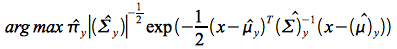

##Background
In machine learning the term *classification* is used when we want to predict a discrete category or class.  The outcome can be binary, as in "spam" or "not spam", or it can be multi-class, as in the set of digits from 0 to 9.  The resulting model is called a *classifier*.  When the outcome is continuous, as in a credit score or price, the term *prediction* is used instead of classification.

##The MNIST handwritten digits problem
We are asked to build three classifiers for the [MNIST (Mixed National Institute of Standards and Technology) handwritten digits dataset](http://yann.lecun.com/exdb/mnist/)[1] and compare their performance.  Specifically, we have been asked to implement a *k-nearest neighbors* classifier, a *Bayes* classifier, and a *logistic regression* classifier.   

##Preprocessing and dimension reduction
The data that we are given has been preprocessed to reduce the number of features.  This is called dimension reduction through principal components analysis (PCA).  At a high level it involves finding the eigenvalues and eigenvectors of a matrix, a process known as spectral decomposition.  In mathematics an eigenvalue and eigenvector form a pair.   An eigenvalue is a number that tells you how much variance exists in the direction of its eigenvector. 

The number of eigenvalues/eigenvectors for a dataset is equal to the number of features.  In fact, the German word *eigen* translates to *own* or *self*.  The eigenvector with the highest eigenvalue is the first *principal component* because it contains more variance than any other eigenvector, unless of course there is a tie.  

PCA allows you to reduce the number of dimensions by replacing them with the eigenvectors that explain *most* of the variance in the observed data.  On the downside, the meaning of the underlying data is abstracted away, making it more difficult to explain your classification or prediction results in context.  That said, base R provides a handy *eigen* function that returns the eigenvalues and eigenvectors of a matrix.  

##The data 
We are given a training set of 5000 handwritten digits and a testing set of 500 handwritten digits. Each observation is a numeric vector of 20 synthetic features obtained through PCA.  Separately we are given the *labels* or actual outcomes.  The possible outcomes are called *classes*, in this case the digits 0 through 9.  

This is a *supervised learning* problem because we know the outcomes, even for the testing set.  We will use the training labels to *learn* the model and we will use the testing labels to evaluate the performance of the model.  If the model performs well, we can run it on future test cases where the label is not known.  If we continue to receive more labeled data, we can continue to train or *learn* the model. 

```{r, echo=FALSE}
## Read the data
setwd(".")
Xtrain <- as.matrix(read.table("./mnist_csv/Xtrain.txt", sep=',', dec='.',
                               check.names=FALSE, fill=FALSE, blank.lines.skip=TRUE))

Ytrain <- as.matrix(read.table("./mnist_csv/label_train.txt", sep=',', dec='.', 
                     check.names=FALSE, fill=FALSE, blank.lines.skip=TRUE))

Xtest <- as.matrix(read.table("./mnist_csv/Xtest.txt", sep=',', dec='.', 
                              check.names=FALSE, fill=FALSE, blank.lines.skip=TRUE))
Ytest <- as.matrix(read.table("./mnist_csv/label_test.txt", sep=',', dec='.', 
                    check.names=FALSE, fill=FALSE, blank.lines.skip=TRUE))

Q <- as.matrix(read.table("./mnist_csv/Q.txt", sep=',', dec='.', 
                check.names=FALSE, fill=FALSE, blank.lines.skip=TRUE))
```

```{r, echo=TRUE}
dim(Xtrain)
head(cbind(Ytrain, Xtrain))
```

##Building a k-Nearest Neighbors classifier
For each test case we calculate the Euclidean distance between it and *every* training case.  We then get the indices of the *k-nearest neighbors* in the training set.  Our prediction for a test case is the label that occurs most frequently amongst its k nearest neighbors.  

We repeat this process for k = 1, 2, 3, 4, and 5.  We compare the prediction accuracy obtained for each k and choose the best k.  

In order to assess prediction accuracy for eack k, we populate a *confusion matrix* where one axis represents the predicted label and the other represents the actual label.  The numbers along the diagonal tell us how many predictions were correct.  Off-diagonal entries indicate the number of test cases that were misclassified.  Prediction accuracy is sum of the diagonal elements, also known as the matrix *trace*, divided by the number of test cases.  

We see that k-NN with k=1 performed best on the testing set, with 94.8% accuracy.  

```{r, echo=FALSE}
n <- nrow(Xtest)
Ypred <- vector(mode="integer", length=n)
options(warn=-1)
```

```{r, echo=TRUE}
classifyKNN <- function( k=1, X, Xtrain, Ytrain ) {        
        ## Compute Euclidean distance from X to each vector in Xtrain
        
        r <- nrow(Xtrain)
        d <- ncol(Xtrain)
        Xdist <- vector(mode="numeric", length=r)
        
        for (i in 1:r) {
                Xdist[i] <- sum( (X - Xtrain[i,])^2 )
        }
        Xdist <- sqrt(Xdist)
        
        ## Get the indices of the k-nearest neighbors
        kNN <- vector(mode="numeric", length=k)
        kNN <- which ( rank(Xdist, ties.method='random', na.last=TRUE) <= k )
        
        ## Return the class that appears most frequently amongst the k-NN;  
        ## table is an R fn that returns a contingency table, which gives us the frequencies 
        y  <- Ytrain[kNN]
        yf <- as.data.frame( table(y), stringsAsFactors=FALSE )
        ind  <- which ( yf$Freq == max(yf$Freq) )
        as.integer( yf[ind,1] )       
}

calcTrace <- function(M) {
        ## Assumes M is a square matrix
        r <- nrow(M)
        Mtrace <- 0
        for (i in 1:r) {
                Mtrace <- Mtrace + M[i,i] 
        }
        Mtrace
}

for (k in 1:5) {
        #C is the confusion matrix
        Cnames <- as.character(c(0:9))
        C <- matrix( rep(0), nrow=10, ncol=10, byrow=TRUE, dimnames=list(Cnames, Cnames))
        for (i in 1:n) {
                Ypred[i] <- classifyKNN( k, Xtest[i,], Xtrain, Ytrain )
                C[Ytest[i]+1, Ypred[i]+1] <- C[Ytest[i]+1, Ypred[i]+1] + 1
        }
        pred_accuracy <- calcTrace(C) / n
        cat("\nk = ",k, "\nPrediction accuracy = ", pred_accuracy, "\n")
        cat("Confusion Matrix: \n")
        print(C)
}
```

```{r, echo=FALSE}
options(warn=0)
```

##Building a Bayes classifier
This model uses the underlying structure of the data for each class.  It applies Bayes theorem to convert a *prior probability* into a *posterior probability* using class-specific maximum likelihood estimates for mean and variance. The prior probability for a class is simply the frequency of that class in our training dataset.   
We will first compute the empirical mean and the empirical covariance matrix for each class (0-9) from our training data.  For each test case we will solve a *plug-in classifier* for each of the 10 classes.  The plug-in classifier is:  


Our prediction is the class that yields the maximum posterior probability.  

```{r, echo=FALSE}
training_set <- as.data.frame( cbind(Ytrain, Xtrain) )
test_set     <- as.data.frame( cbind(Ytest,  Xtest) )
names(training_set)[1] <- "y"
names(test_set)[1]     <- "y"

## Define the confusion matrix
Cnames <- as.character(c(0:9))
C <- matrix( rep(0), nrow=10, ncol=10, byrow=TRUE, dimnames=list(Cnames, Cnames))

require("dplyr")
```

```{r, echo=TRUE}
getMu <- function(class) {
        g1  <- filter( training_set, y==class )
        MU <- as.matrix( summarise_each(g1, funs(mean)) )
        MU[1,-1]
}

getSigma <- function(class, class_mu) {
        x <- as.matrix( filter( training_set, y==class )[,-1] )
        class_n <- nrow(x)
        d <- 20
        for ( j in 1:d ) {
                mu    <- class_mu[1,j]
                x[,j] <- x[,j] - mu
        }
        SIGMA <- as.matrix( t(x) %*% x )
        SIGMA <- SIGMA / class_n
        SIGMA
}

getPrior <- function(class, n) {
        g1  <- filter( training_set, y==class )
        PI <- as.numeric( summarise(g1, p = n() / n) )
        PI
}

classifyBayes <- function( x, y, case, explore=FALSE ) {       
        class_MU      <- matrix(rep(0), nrow=1,  ncol=20)
        class_SIGMA   <- matrix(rep(0), nrow=20, ncol=20)
        class_SIGMA_I <- matrix(rep(0), nrow=20, ncol=20)
        classifier    <- vector("integer", 10)
        
        X  <- as.matrix(x)
        y  <- as.integer(y)
        n  <- nrow(Ytrain)
        p1 <- p2 <- p3 <- p4 <- 0
        for (k in 1:10) {
                class_prior   <- getPrior( class=k-1, n )  
                class_MU      <- as.matrix( getMu( class=k-1 ) ) 
                class_SIGMA   <- getSigma( class=k-1, t(class_MU) )
                class_SIGMA_I <- solve(class_SIGMA) 
                
                p1 <- -0.5 * t(X - class_MU)
                p2 <- p1 %*% class_SIGMA_I
                p3 <- p2 %*% (x - class_MU)
                p4 <- exp(p3)
                classifier[k] <- prod(class_prior, 1/sqrt(det(class_SIGMA)), p4)
        }
        winner <- as.integer( which (classifier == max(classifier)) )
        as.integer( winner-1 )
}

calcTrace <- function(M) {
        ## Assumes M is a square matrix
        r <- nrow(M)
        Mtrace <- 0
        for (i in 1:r) {
                Mtrace <- Mtrace + M[i,i] 
        }
        Mtrace
}

n <- nrow(Ytest)
Ypred  <- vector(mode="integer", length=n)
for (i in 1:n) {
        Ypred[i] <- classifyBayes( Xtest[i,], Ytest[i], i )
        C[Ytest[i]+1, Ypred[i]+1] <- C[Ytest[i]+1, Ypred[i]+1] + 1    
}
pred_accuracy <- 0
if (n > 0) {
        pred_accuracy <- calcTrace(C) / n
}
```

```{r, echo=FALSE}
cat("Confusion Matrix: \n")
print(C)
cat("\nNumber of test cases = ", n, "\nPrediction accuracy = ", pred_accuracy, "\n")
```

At 93.6% accuracy, the Bayes classifier did not perform better than k-Nearest Neighbors on our testing data.

##Building a Multiclass Logistic Regression Classifier
Logistic regression is an example of a *generalized linear model* or GLM.  Its response variable is discrete with two possible outcomes, so it is appropriate for binary classification problems.  

Logistic regression uses the logit function, which is the natural log of the probability that the response variable Y is 1, divided by the probability that Y is 0.  This can be written as: *ln[P/(1-P)] = B0 + B1*X1 + B2*X2 + ...*, where the left side of the equation is the logit function and the right side is linear in the coefficients.

To solve for P we apply the exponential function to both sides.

It genearlizes logistic regression from a binary problem to a multi-class problem.  It makes use of the S-shaped *sigmoid function* to map a K-dimensional vector of real values to a K-dimensional vector of real values in the range (0,1).  


##References
1. "MNIST database", Wikipedia (2013, August 17). [https://en.wikipedia.org/wiki/MNIST_database](https://en.wikipedia.org/wiki/MNIST_database)

